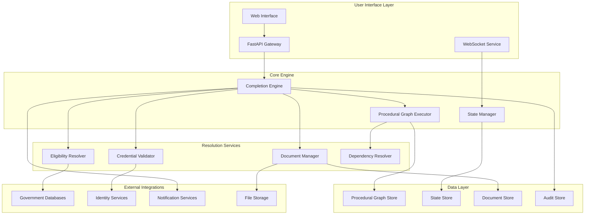

# Design Document: Procedural Completion Engine for Public Services

## Overview

The Procedural Completion Engine represents a paradigm shift from traditional government service portals. Rather than presenting static forms or information directories, this system executes complete government procedures as stateful workflows. The core innovation lies in treating every dependency as a first-class procedural workflow, enabling the system to resolve complex prerequisite chains that typically prevent citizens from successfully completing government services.

The system models each public service (certificates, schemes, licenses) as a Procedural Graph—a directed acyclic graph that captures not just the happy path, but all possible states, failure conditions, recovery mechanisms, and dependency relationships. When a citizen requests a service, the system doesn't assume they're ready to apply. Instead, it performs a comprehensive dependency analysis, identifies gaps in eligibility, documents, or credentials, and executes sub-procedures to resolve each dependency before proceeding to the target service.

This approach transforms the citizen experience from navigating fragmented systems and requirements to following a guided, end-to-end process that handles all complexities automatically. The system architecture follows a microservices pattern with sophisticated state management, enabling resilient execution of long-running procedures that may span days or weeks.

## Architecture

### High-Level Architecture



### Component Responsibilities

**Completion Engine**: Orchestrates the entire procedural execution lifecycle using FastAPI for web service endpoints, coordinating between all subsystems and managing the overall workflow state.

**Procedural Graph Executor**: Interprets and executes procedural graph definitions, handling state transitions, decision logic, and failure scenarios.

**State Manager**: Provides persistent, transactional state management with support for rollback, recovery, and concurrent access.

**Dependency Resolver**: Recursively identifies and resolves procedural dependencies, treating each dependency as a sub-procedure.

**Eligibility Resolver**: Evaluates complex eligibility criteria against user profiles and external data sources.

**Document Manager**: Handles document lifecycle including collection, validation, storage, and retrieval with support for multiple formats and substitutions.

**Credential Validator**: Manages authentication, authorization, and credential verification using government-approved identity systems.

## Components and Interfaces

### Procedural Graph Structure

The procedural graph is represented as a directed acyclic graph where each node represents a procedural step and edges represent valid transitions. The graph supports several node types implemented using Python and Pydantic models:

```python
from pydantic import BaseModel
from typing import Dict, List, Optional, Any
from enum import Enum

class ProceduralGraph(BaseModel):
    id: str
    version: str
    name: str
    description: str
    nodes: Dict[str, 'ProceduralNode']
    edges: List['ProceduralEdge']
    entry_point: str
    exit_points: List[str]
    metadata: 'GraphMetadata'

class ProceduralNode(BaseModel):
    id: str
    type: 'NodeType'
    name: str
    description: str
    configuration: 'NodeConfiguration'
    dependencies: List['Dependency']
    timeout_ms: Optional[int] = None
    retry_policy: Optional['RetryPolicy'] = None

class NodeType(str, Enum):
    START = 'start'
    END = 'end'
    ACTION = 'action'
    DECISION = 'decision'
    DOCUMENT_COLLECTION = 'document_collection'
    ELIGIBILITY_CHECK = 'eligibility_check'
    EXTERNAL_INTEGRATION = 'external_integration'
    HUMAN_REVIEW = 'human_review'
    DEPENDENCY_RESOLUTION = 'dependency_resolution'

class ProceduralEdge(BaseModel):
    from_node: str
    to_node: str
    condition: Optional['EdgeCondition'] = None
    weight: int
```
```

### State Management Interface

The state management system provides ACID transactions with support for complex state queries and updates using Python async/await patterns:

```python
from typing import List, Optional
from datetime import datetime
from abc import ABC, abstractmethod

class StateManager(ABC):
    @abstractmethod
    async def create_execution(self, graph_id: str, user_id: str, context: 'ExecutionContext') -> str:
        """Create a new execution instance"""
        pass
    
    @abstractmethod
    async def get_execution_state(self, execution_id: str) -> 'ExecutionState':
        """Retrieve current execution state"""
        pass
    
    @abstractmethod
    async def update_execution_state(self, execution_id: str, updates: List['StateUpdate']) -> None:
        """Update execution state transactionally"""
        pass
    
    @abstractmethod
    async def rollback_to_checkpoint(self, execution_id: str, checkpoint_id: str) -> None:
        """Rollback to a previous checkpoint"""
        pass
    
    @abstractmethod
    async def create_checkpoint(self, execution_id: str, description: str) -> str:
        """Create a new checkpoint"""
        pass

class ExecutionState(BaseModel):
    execution_id: str
    graph_id: str
    user_id: str
    current_node: str
    node_states: Dict[str, 'NodeState']
    global_context: 'ExecutionContext'
    checkpoints: List['Checkpoint']
    audit_trail: List['AuditEntry']
    status: 'ExecutionStatus'
    created_at: datetime
    updated_at: datetime

class ExecutionStatus(str, Enum):
    PENDING = 'pending'
    RUNNING = 'running'
    WAITING_INPUT = 'waiting_input'
    WAITING_EXTERNAL = 'waiting_external'
    COMPLETED = 'completed'
    FAILED = 'failed'
    CANCELLED = 'cancelled'
```
```

### Dependency Resolution Interface

Dependencies are resolved through a recursive system that treats each dependency as a procedural workflow using Python async processing:

```python
class DependencyResolver(ABC):
    @abstractmethod
    async def resolve_dependencies(self, dependencies: List['Dependency'], context: 'ExecutionContext') -> 'ResolutionResult':
        """Resolve all dependencies recursively"""
        pass
    
    @abstractmethod
    async def get_dependency_graph(self, root_dependency: 'Dependency') -> 'DependencyGraph':
        """Build dependency graph for analysis"""
        pass
    
    @abstractmethod
    async def execute_dependency_workflow(self, dependency: 'Dependency', context: 'ExecutionContext') -> 'DependencyResult':
        """Execute a single dependency as a workflow"""
        pass

class Dependency(BaseModel):
    id: str
    type: 'DependencyType'
    name: str
    description: str
    required: bool
    configuration: 'DependencyConfiguration'
    alternatives: List['Dependency']

class DependencyType(str, Enum):
    DOCUMENT = 'document'
    ELIGIBILITY = 'eligibility'
    CREDENTIAL = 'credential'
    EXTERNAL_APPROVAL = 'external_approval'
    PREREQUISITE_SERVICE = 'prerequisite_service'

class ResolutionResult(BaseModel):
    resolved: List['Dependency']
    unresolved: List['Dependency']
    failed: List['DependencyFailure']
    resolution_paths: List['ResolutionPath']
```
```

### Document Management Interface

The document management system handles the complete document lifecycle with validation and storage using Python:

```python
class DocumentManager(ABC):
    @abstractmethod
    async def get_required_documents(self, node_id: str, context: 'ExecutionContext') -> List['DocumentRequirement']:
        """Get documents required for a specific node"""
        pass
    
    @abstractmethod
    async def validate_document(self, document: 'Document', requirement: 'DocumentRequirement') -> 'ValidationResult':
        """Validate a document against requirements"""
        pass
    
    @abstractmethod
    async def store_document(self, document: 'Document', execution_id: str) -> str:
        """Store document securely"""
        pass
    
    @abstractmethod
    async def retrieve_document(self, document_id: str) -> 'Document':
        """Retrieve stored document"""
        pass
    
    @abstractmethod
    async def find_alternative_documents(self, requirement: 'DocumentRequirement') -> List['DocumentRequirement']:
        """Find acceptable alternative documents"""
        pass

class DocumentRequirement(BaseModel):
    id: str
    name: str
    description: str
    format: 'DocumentFormat'
    validation_rules: List['ValidationRule']
    alternatives: List['DocumentRequirement']
    expiration_policy: Optional['ExpirationPolicy'] = None

class Document(BaseModel):
    id: Optional[str] = None
    name: str
    type: str
    content: bytes
    metadata: 'DocumentMetadata'
    uploaded_at: datetime
    validated_at: Optional[datetime] = None

class ValidationResult(BaseModel):
    is_valid: bool
    errors: List['ValidationError']
    warnings: List['ValidationWarning']
    extracted_data: Optional['ExtractedData'] = None
```
```

## Data Models

### Core Domain Models

The system's data models reflect the complex relationships between procedures, users, and government services using Python and Pydantic:

```python
# User and Context Models
class User(BaseModel):
    id: str
    profile: 'UserProfile'
    credentials: List['UserCredential']
    preferences: 'UserPreferences'
    active_executions: List[str]

class UserProfile(BaseModel):
    personal_info: 'PersonalInfo'
    contact_info: 'ContactInfo'
    eligibility_factors: List['EligibilityFactor']
    document_portfolio: 'DocumentPortfolio'

class ExecutionContext(BaseModel):
    user_id: str
    session_id: str
    user_profile: 'UserProfile'
    environment_variables: Dict[str, Any]
    temporary_data: Dict[str, Any]
    external_references: Dict[str, str]

# Procedural Models
class NodeState(BaseModel):
    node_id: str
    status: 'NodeStatus'
    entered_at: Optional[datetime] = None
    completed_at: Optional[datetime] = None
    attempts: int = 0
    last_error: Optional[str] = None
    output_data: Dict[str, Any]
    checkpoints: List[str]

class NodeStatus(str, Enum):
    PENDING = 'pending'
    ACTIVE = 'active'
    COMPLETED = 'completed'
    FAILED = 'failed'
    SKIPPED = 'skipped'
    WAITING = 'waiting'

# Integration Models
class ExternalIntegration(BaseModel):
    id: str
    name: str
    type: 'IntegrationType'
    endpoint: str
    authentication: 'AuthenticationConfig'
    retry_policy: 'RetryPolicy'
    timeout_ms: int
    rate_limits: List['RateLimit']

class IntegrationType(str, Enum):
    REST_API = 'rest_api'
    SOAP_SERVICE = 'soap_service'
    DATABASE_QUERY = 'database_query'
    FILE_TRANSFER = 'file_transfer'
    MESSAGE_QUEUE = 'message_queue'
```
```

### Persistence Models

The system uses a polyglot persistence approach with different storage systems optimized for specific data types:

**Graph Store (Neo4j/ArangoDB)**: Stores procedural graph definitions and dependency relationships
**State Store (PostgreSQL)**: Manages execution state with ACID transactions
**Document Store (MongoDB/S3)**: Handles document storage with metadata indexing
**Audit Store (Elasticsearch)**: Provides searchable audit trails and analytics
**Cache Layer (Redis)**: Caches frequently accessed data and session information

### Configuration Models

```python
class SystemConfiguration(BaseModel):
    execution_limits: 'ExecutionLimits'
    security_policies: List['SecurityPolicy']
    integration_configs: Dict[str, 'IntegrationConfig']
    notification_templates: List['NotificationTemplate']
    audit_policies: List['AuditPolicy']

class ExecutionLimits(BaseModel):
    max_concurrent_executions: int
    max_execution_duration_ms: int
    max_dependency_depth: int
    max_retry_attempts: int
    max_document_size_mb: int

class SecurityPolicy(BaseModel):
    id: str
    name: str
    rules: List['SecurityRule']
    applicable_services: List[str]
    enforcement_level: 'EnforcementLevel'
```

## Correctness Properties

*A property is a characteristic or behavior that should hold true across all valid executions of a system—essentially, a formal statement about what the system should do. Properties serve as the bridge between human-readable specifications and machine-verifiable correctness guarantees.*

Based on the prework analysis and property reflection, the following properties ensure the system's correctness across all scenarios:

### Property 1: Procedural Graph Structure Integrity
*For any* public service definition, when converted to a procedural graph, the resulting graph should contain all required node types (decision points, failure states, recovery paths), maintain state information for each step, and have all paths leading to either completion or valid recovery states.
**Validates: Requirements 1.1, 1.2, 1.3, 1.4**

### Property 2: Dependency Resolution Workflow
*For any* user request with unmet dependencies, the system should identify all dependencies, treat each as a first-class procedural graph, execute dependency resolution workflows before the main procedure, support recursive resolution, and automatically proceed to the main procedure when all dependencies are resolved.
**Validates: Requirements 2.1, 2.2, 2.3, 2.4, 2.5**

### Property 3: Document Management Lifecycle
*For any* procedure requiring documents, the system should specify exact document requirements, validate uploaded documents against criteria, provide specific guidance for validation failures, store validated documents securely for reuse, and support document substitution when alternatives are available.
**Validates: Requirements 3.1, 3.2, 3.3, 3.4, 3.5**

### Property 4: State Persistence and Recovery
*For any* active procedural execution, the system should persist workflow state, restore exact state when users return to incomplete procedures, maintain complete audit trails, recover to last consistent state after failures, and support rollback to previous states when recovery paths are triggered.
**Validates: Requirements 4.1, 4.2, 4.3, 4.4, 4.5**

### Property 5: Failure Recovery Management
*For any* procedure step failure, the system should identify available recovery paths, provide clear explanations of failure reasons and corrective actions, present multiple recovery options in order of recommendation, allow retry after addressing issues, and escalate to human review with complete context when no recovery path exists.
**Validates: Requirements 5.1, 5.2, 5.3, 5.4, 5.5**

### Property 6: Eligibility Evaluation System
*For any* user and service combination, the eligibility resolver should evaluate qualifications against service-specific criteria, identify specific deficiencies and suggest remediation when checks fail, support both automated and manual review processes, handle complex rules including conditional and time-based requirements, and automatically re-evaluate affected procedures when eligibility status changes.
**Validates: Requirements 6.1, 6.2, 6.3, 6.4, 6.5**

### Property 7: Credential Management Security
*For any* user authentication attempt, the credential validator should use only government-approved identity verification methods, maintain secure encrypted credential storage, prompt for renewal when credentials expire, support multiple authentication factors for high-security procedures, and log all verification attempts for security auditing.
**Validates: Requirements 7.1, 7.2, 7.3, 7.4, 7.5**

### Property 8: Progress Tracking and Notifications
*For any* active procedure execution, the system should provide accurate real-time progress indicators, notify users through preferred channels when significant state changes occur, estimate completion timeframes based on progress and historical data, send reminders for time-sensitive actions, and provide detailed status reports accessible to appropriate parties.
**Validates: Requirements 8.1, 8.2, 8.3, 8.4, 8.5**

### Property 9: External System Integration
*For any* external system interaction, the system should integrate correctly with government identity databases, connect to document repositories for authorized retrieval, submit completed applications to appropriate agencies, handle API failures gracefully with retry mechanisms and fallbacks, and maintain data synchronization while respecting privacy requirements.
**Validates: Requirements 9.1, 9.2, 9.3, 9.4, 9.5**

### Property 10: Configuration Management
*For any* procedural configuration change, the system should support hot-swapping without affecting active procedures, provide version control with rollback capabilities, safely migrate active workflows to new versions when changes affect them, validate new configurations before deployment, and provide administrative interfaces for monitoring and managing all active procedures.
**Validates: Requirements 10.1, 10.2, 10.3, 10.4, 10.5**

### Property 11: Nested Graph Execution
*For any* procedural graph with nested sub-graphs (dependencies), the system should execute nested graphs as independent workflows while maintaining parent-child relationships and properly propagate state changes between nested and parent graphs.
**Validates: Requirements 1.5**

## Error Handling

The system implements a comprehensive error handling strategy with multiple layers of resilience:

### Error Classification

**Transient Errors**: Network timeouts, temporary service unavailability, rate limiting
- **Strategy**: Exponential backoff retry with jitter
- **Recovery**: Automatic retry up to configured limits
- **Fallback**: Queue for later processing or alternative service endpoints

**Permanent Errors**: Invalid credentials, missing permissions, malformed data
- **Strategy**: Immediate failure with detailed error context
- **Recovery**: User intervention required with specific guidance
- **Fallback**: Alternative workflows or manual processing paths

**System Errors**: Database failures, service crashes, resource exhaustion
- **Strategy**: Circuit breaker pattern with health checks
- **Recovery**: Automatic failover to backup systems
- **Fallback**: Graceful degradation with limited functionality

### Recovery Mechanisms

**State Rollback**: All state changes are transactional with rollback capabilities
**Checkpoint Recovery**: Regular checkpoints allow recovery to known good states
**Alternative Paths**: Multiple execution paths for critical operations
**Human Escalation**: Automatic escalation when automated recovery fails

### Error Context Preservation

All errors maintain complete context including:
- User session information
- Execution state at time of failure
- Attempted recovery actions
- External system responses
- Audit trail of all actions leading to failure

## Testing Strategy

The system employs a comprehensive dual testing approach combining unit tests for specific scenarios with property-based tests for universal correctness validation.

### Property-Based Testing

**Framework**: Property-based testing using Hypothesis (Python) for comprehensive input coverage
**Configuration**: Minimum 1000 iterations per property test to ensure comprehensive coverage
**Test Data Generation**: Custom generators for procedural graphs, user profiles, documents, and system states using Hypothesis strategies
**Shrinking**: Automatic test case minimization to identify minimal failing examples

Each property test is tagged with the format: **Feature: procedural-completion-engine, Property {number}: {property_text}**

### Unit Testing Strategy

**Specific Examples**: Test concrete scenarios that demonstrate correct behavior
**Edge Cases**: Test boundary conditions, empty inputs, maximum limits
**Integration Points**: Test component interactions and data flow
**Error Conditions**: Test specific failure scenarios and recovery paths

**Balance Principle**: Property tests handle comprehensive input coverage while unit tests focus on specific examples, edge cases, and integration scenarios. Together they provide complete validation coverage.

### Test Categories

**Graph Validation Tests**: Verify procedural graph structure and validation logic
**Execution Engine Tests**: Test workflow execution, state transitions, and decision logic
**Dependency Resolution Tests**: Validate recursive dependency resolution and workflow orchestration
**Document Management Tests**: Test document lifecycle, validation, and storage
**State Management Tests**: Verify persistence, recovery, and rollback functionality
**Integration Tests**: Test external system interactions and API integrations
**Security Tests**: Validate authentication, authorization, and data protection
**Performance Tests**: Verify system performance under load and stress conditions

### Test Data Management

**Synthetic Data Generation**: Generate realistic test data that covers edge cases
**Data Privacy**: Ensure no real government or personal data is used in testing
**Test Isolation**: Each test runs with clean state and independent data
**Reproducibility**: All tests are deterministic and reproducible across environments